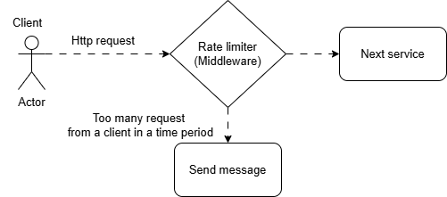

# 🚀 Rate Limiter (Sliding Window Algorithm)

## 📖 Introduction
A **Rate Limiter** is a mechanism used to **control the number of requests** a client can make to a server **within a specified time period**. This helps prevent **abuse, brute-force attacks, and excessive server load**.

For example, if an API allows **100 requests per minute**, and a client sends 101 requests, the last request will be **denied** until the next time window starts.



## 🔍 What is a Sliding Window Algorithm?
The **Sliding Window Algorithm** is a technique used for rate limiting that allows more flexibility than **fixed window** methods.

### 📝 Example:
Imagine you have an **API limit of 5 requests per 10 seconds**.

1. A user sends **3 requests at 00:00** → ✅ **All Allowed**.
2. The user tries another request at **00:02** → ❌ **Denied** (Limit reached).
3. At **00:10**, the first request from 00:00 is removed from the count.
4. The user can now send **1 more request** before hitting the limit again.

This method ensures **continuous request handling** instead of resetting limits at fixed intervals.

## ⚙️ Features of this Rate Limiter
- Uses the **Sliding Window Algorithm** for flexible rate limiting.
- Prevents **abuse** and **DDoS attacks**.
- Can be **customized** for different APIs.

## 🏗️ Tech Stack
- **Node.js**
- **Express.js**


## 🚀 Want to do by yourself!


### 1️⃣ Create `rateLimiter.js`
```sh
# Create the file
nano rateLimiter.js
```

📌 Paste the following code:

```js
const rateLimit = {};
const WINDOW_SIZE_IN_MS = 10000; // 10 seconds
const MAX_REQUESTS = 3;

const rateLimiter = (req, res, next) => {
    const clientIp = req.ip;
    const currentTime = Date.now();

    if (!rateLimit[clientIp]) {
        rateLimit[clientIp] = [];
    }

    // Remove old timestamps outside the window
    rateLimit[clientIp] = rateLimit[clientIp].filter(timestamp => currentTime - timestamp < WINDOW_SIZE_IN_MS);

    if (rateLimit[clientIp].length >= MAX_REQUESTS) {
        return res.status(429).json({ message: "Too many requests. Please wait." });
    }

    rateLimit[clientIp].push(currentTime);
    next();
};

module.exports = rateLimiter;
```

✅ Save and exit:
- Press `CTRL + X`, then `Y`, then `ENTER`.

### 2️⃣ Create `server.js`
```sh
# Create the file
nano server.js
```

📌 Paste the following code:

```js
const express = require("express");
const rateLimiter = require("./rateLimiter");

const app = express();
app.use(rateLimiter);

app.get("/", (req, res) => {
    res.send("Hello, this is a rate-limited API!");
});

app.listen(3000, () => console.log("Server running on port 3000"));
```

✅ Save and exit:
- Press `CTRL + X`, then `Y`, then `ENTER`.

---

## 🚀 Step 4: Dockerize the Application

### 1️⃣ Create `Dockerfile`
```sh
# Create the file
nano Dockerfile
```

📌 Paste the following code:

```dockerfile
# Use official Node.js image
FROM node:18

# Set working directory
WORKDIR /app

# Copy package.json and install dependencies
COPY package.json package-lock.json ./
RUN npm install

# Copy source code
COPY . .

# Expose port
EXPOSE 3000

# Start the server
CMD ["node", "server.js"]
```

✅ Save and exit:
- Press `CTRL + X`, then `Y`, then `ENTER`.


Using the following command we can test the server. Here the server can handel 3 request in a 10s time period
```sh
# Create the file
curl http://localhost:3000
```


Here we can see that for the first three request the output is Hello, this is a rate-limited API! but for the 4th request we can see
 the error message 


### ✅ Example Scenario:
| Request | Time | Allowed? |
|---------|------|---------|
| 1st | 0s  | ✅ Yes |
| 2nd | 2s  | ✅ Yes |
| 3rd | 5s  | ✅ Yes |
| 4th | 6s  | ❌ No (429 Too Many Requests) |
| 5th | 11s | ✅ Yes (Old requests expired) |

This ensures fair usage and prevents abuse of the API.

